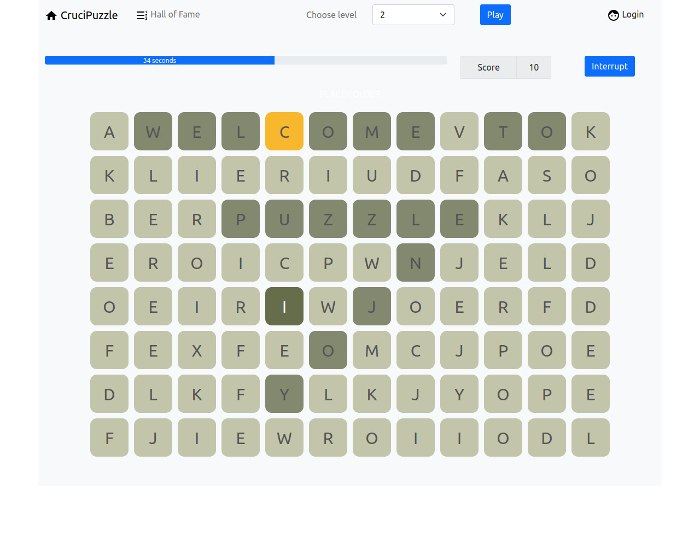
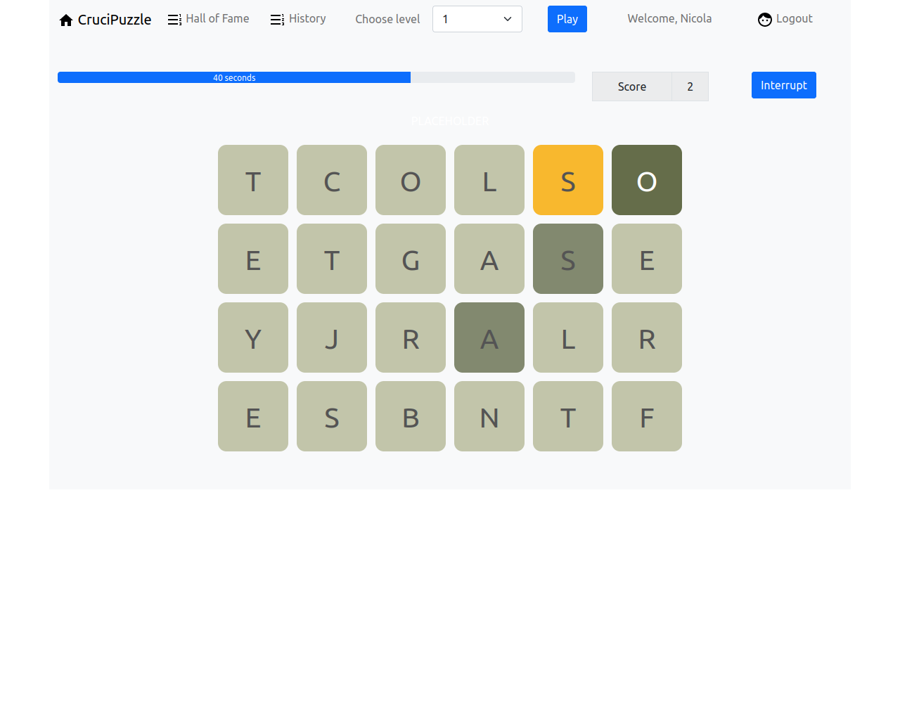

# Title: "CruciPuzzle"
## Author: GUGLIELMI NICOLA 

## React Client Application Routes

- Route `/`: Redirect to Home page of app
- Route `/home`: Home page for unauthenticated users
- Route `/users`: Home page for authenticated users
- Route `/newMatch/:level`: Page with a new game for unauthenticated users, 
                            the param level is the level choosen from the user for a new game
- Route `/users/newMatch/:level`: Page with a new game for authenticated users,
                            the param level is the level choosen from the user for a new game

## API Server

- GET `/api/hallOfFame`
  - description: Request list of 5 best game played of users
  - request parameters: none
  - respond body: [{
                    "pos": 1,
                    "name": "Nicola",
                    "score": 725
                  }, {
                      "pos": 2,
                      "name": "Nicola",
                      "score": 475
                  }]
  - Response: 200 Ok (Success)
	            500 Internal Server Error (Any errors on db)

- GET `/api/history`
  - description: Request list of history games of played 
  - request parameters: none
  - respond body: [{
                     "pos": 1,
                     "nWords": 4,
                     "level": 2,
                     "score": 12
                    }, {
                      "pos": 2,
                      "nWords": 1,
                      "level": 2,
                      "score": 2
                  }]
  - Response: 200 Ok (Success)
	            500 Internal Server Error (Any errors on db)
              401 Bad Request (Anauthorized user)

- GET `/api/newMatch/?level=${level}`
  - description: Request a random string of letters to start a new game
  - request parameters: level of game choosen by player
  - response body content: {
                          letters: "STRINGOFLETTERSTOSTARTANEWGAME"
                        }
  - Response: 200 Ok (Success)
	            500 Internal Server Error (Any errors on db)

- POST `/api/match/verifyWord`
  - description: Request to check the correctness of word, sending points of words found.
                 Server will return an object, with first item is a boolean for validity, 
                 then level, word found, an array with the start and end points and score
                 totalized for this word.
  - request body content: {
                    level: 1,
                    letters: "WORDSTRINGOFLETTERSCURRENTGAME",
                    pointsToCheck: ['0,0','0,3']
                }
  - response body content: {
                    validity: true,
                    letters: "WORDSTRINGOFLETTERSCURRENTGAME",
                    level: 1,
                    word: "word",
                    points: ['0,0','0,3'],
                    score: 4
              }
  - Response: 200 Ok (Success)
	            500 Internal Server Error (Any errors on db)
              400 Bad Request (User data not accettable)

- POST `/api/match/verifyMatch`
- description: Request to check the correctness of game, sending all point of words found.
                 Server will return an object, with first item the string of game checked,
                 then level, the points correct, the total score and the number of words found.
  - request body content: {
                    level: 1,
                    letters: "STRINGOFLETTERSCURRENTGAME",
                    pointsToCheck: [['0,0','0,3'],['2,0','2,5']]
                }
  - response body content: {
                    letters: "STRINGOFLETTERSCURRENTGAME",
                    level: 1,
                    points: [['0,0','0,3'],['2,0','2,5']],
                    score: 10,
                    nWords: 2
              }
  - Response: 200 Ok (Success)
	            500 Internal Server Error (Any errors on db)
              400 Bad Request (User data not accettable)
              401 Bad Request (String of match is not compatible with database. Only for      authenticate users)
              

## Database Tables

- Table `users` - contains ("idUser"	INTEGER PRIMARY KEY AUTOINCREMENT,
                            "email"	TEXT NOT NULL,
                            "name"	TEXT NOT NULL,
                            "pwd"	TEXT NOT NULL
                          )
        Table where is stored the database of users, pwd is password and it is encrypted
                          
- Table `dictionary` - contains ("word"	TEXT,
                                	PRIMARY KEY("word"
                              )
        Table where is stored the database of dictionary

- Table `played` - contains ("idPlay"	INTEGER PRIMARY KEY AUTOINCREMENT,
                            "idPlayer"	INTEGER NOT NULL,
                            "level"	INTEGER NOT NULL,
                            "foundWords"	INTEGER NOT NULL,
                            "score"	INTEGER NOT NULL,
                            FOREIGN KEY("idPlayer") REFERENCES "users"("idUser")
                          )
        Table where is stored the database of all games played by a users

- Table `inGame` - contains ("idPlayer"	INTEGER,
                            "level"	INTEGER NOT NULL,
                            "string"	TEXT NOT NULL,
                            PRIMARY KEY("idPlayer"),
                            FOREIGN KEY("idPlayer") REFERENCES "users"("idUser")
                          )
        Table where is stored the database of string and level for an user who is playing.
        That because the server can verify whether the user is really playing that game or not.

## Main React Components

- `QGame` (in `/Components/QGame.js`): It is core of app. 
                        It will store all state of the game and decide
                        when send to server to validate the word, if the points selected are compatible accordin with game roles.
- `QNavBar` (in `/Components/QNavBar.js`): That is then Navbar to visualize home page, 
                        hall of fame, login/ logout, chose level and start a new play.
- `QTimout` (in `/Components/TimOut.js`): This component who show the timeline of game, 
                        score and it has a button to interrupt the play before time finishes.
                        It shows also the results of game, when it has finished and validate
                        by server.
- `FormLogin` (in `/Components/FormLogin.js`): This component with login form to perform a 
                        login.
- `QGrid, QRow, QCell` (in `/Components/...js`): They are components for visualizing the table 
                        game.
- `PageWelcome, PageWelcomeUser` (in `/views/...js`): They are pages to visualize home pages.
- `HallFame` (in `/views/HallFame.js`): This component built a list of hall fame.
- `History` (in `/views/History.js`): This component built a list of history scores of user.
- `FeedBackWord` (in `/views/FeedBackWord`); It show a feedback when word has been found and
                        it exist on dictionary or not, and shows when the game is over.
- `LoginView, LoginModal` (in `/views/...js`): They are components to visualize FormLogin
- `RankList, HeadOfList` (in `/views/...js`): They are conponents to support the visualizzation
                        of Hall of Fame and History.

## Screenshot

